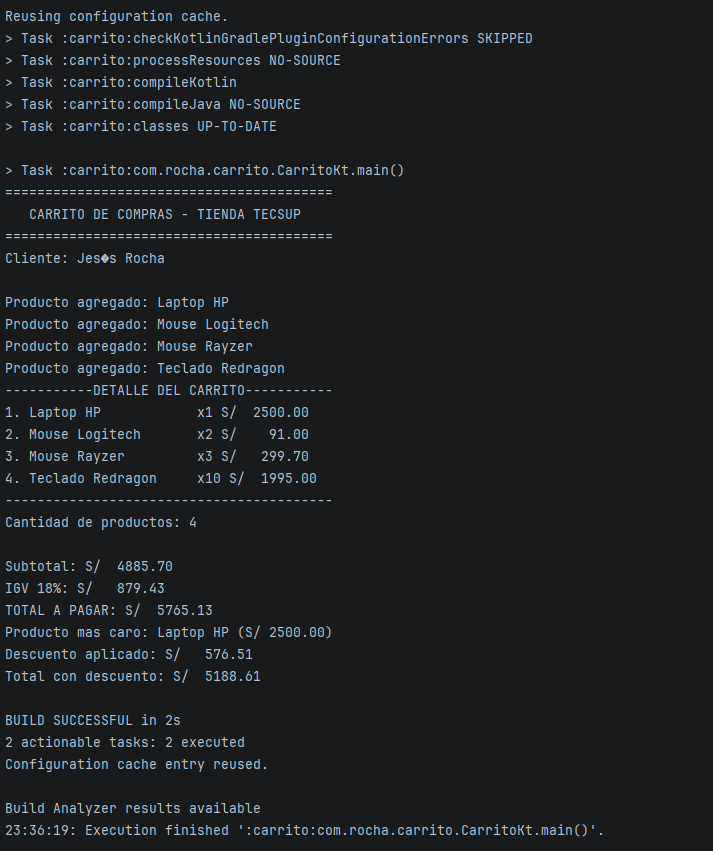

# Laboratorio 02: Kotlin
### Nombre: Jesús Enrique Rocha Bobadilla
## Descripción:
Este programa simula el funcionamiento de un carrito de compras en Kotlin,
ejecutado por consola. Permite agregar productos a un carrito, calcular el
subtotal, el IGV (18%), el total a pagar, mostrar el detalle de cada
producto con columnas alineadas, identificar el producto más caro del
carrito y aplicar un descuento según el monto total de la compra.
## Funciones implementadas:
- **calcularSubtotal**: Calcula el subtotal sumando precio * cantidad de cada producto.
- **calcularIGV**: Calcula el 18% del subtotal (igv).
- **calcularTotal**: Suma el subtotal y el IGV.
- **mostrarDetallesCarrito**: Muestra el detalle del carrito con columnas alineadas y montos con 2 decimales (formato).
- **calcularDescuentoCarrito:** Calcula el descuento según el total. 5% si supera los S/3000 y 10% si supera los S/5000.
## Captura de la consola:

### ¿Por qué nombre y precio son val pero cantidad es var? ¿Qué pasaría si intentas cambiar el precio después de crear el producto?
1. Estas dos variables son val porque no tiene sentido que cuando estemos
   usando un carrito de un mercado/tienda se cambie el nombre o el precio de
   los productos que agregamos. Y sí hay sentido de que la cantidad cambie, ya
   que el cliente puede agregar o quitar unidades del mismo producto mientras
   arma su carrito. Además de que otro usuario podría comprar el mismo
   producto antes que nosotros.

2. Para comprobar qué pasaría, escribí producto.precio = 3000.0 después de
   haber creado el producto, y Android Studio marcó error inmediatamente en
   esa línea. Esto pasa porque precio está declarado como val, lo que lo
   convierte en una propiedad de solo lectura que ya no se puede reasignar
   una vez que el objeto Producto se crea. En cambio, cantidad sí se puede
   cambiar porque está declarada como var, que sí permite reasignación.