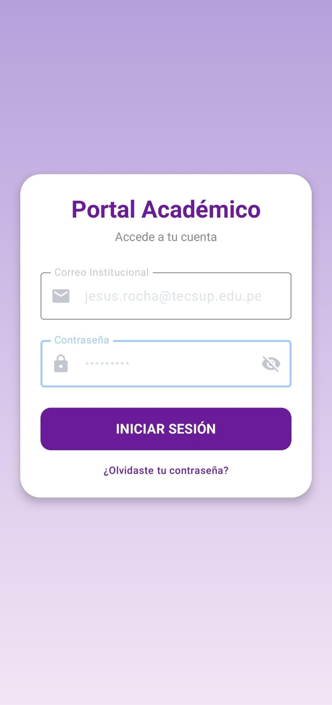
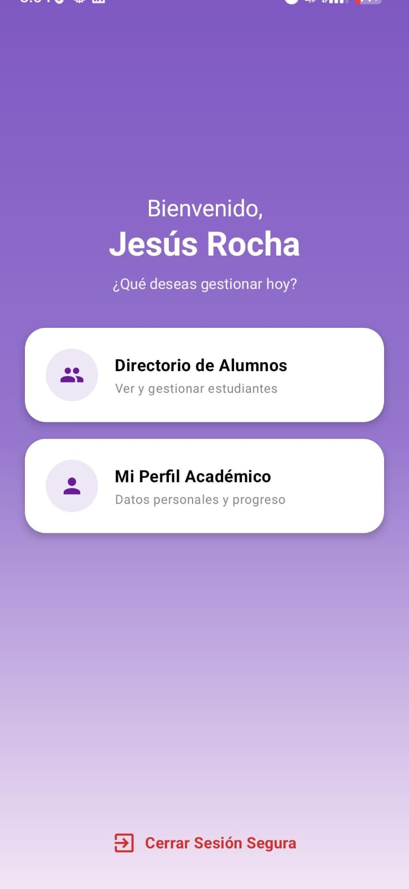
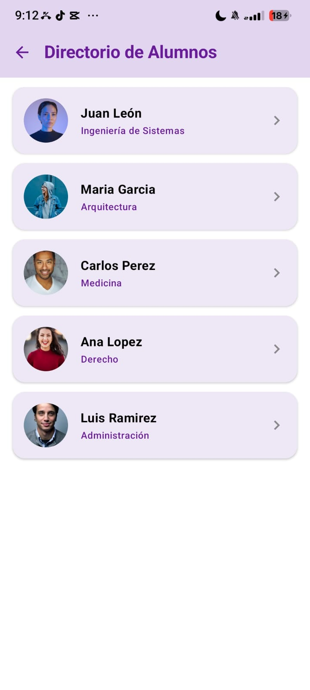
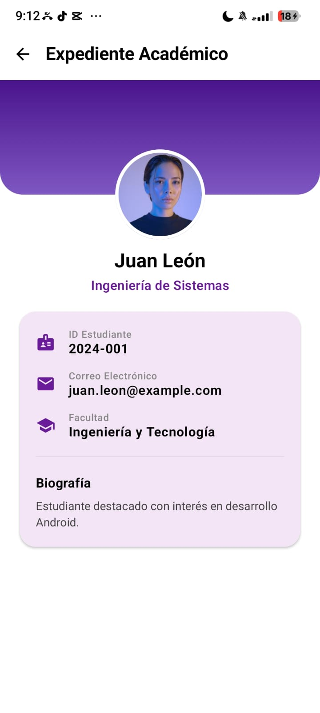
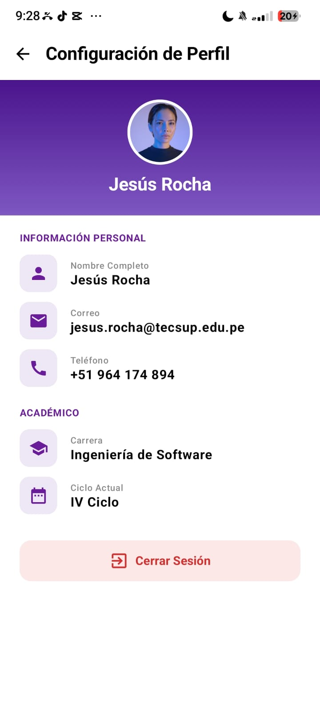

# NavLab - Aplicación de Navegación y Directorio Académico

Aplicación Android desarrollada en Kotlin utilizando **Jetpack Compose**, **Navigation Compose**, **Material 3** y **Coil 3** para la gestión de navegación, inicio de sesión, directorio de estudiantes, expedientes académicos y configuración de perfil.

---

## 🛠️ Estructura del Proyecto

```
com.rocha.navlab/
├── MainActivity.kt
├── navigation/
│   ├── Screen.kt
│   └── AppNavigation.kt
└── ui/
    └── screens/
        ├── LoginScreen.kt
        ├── HomeScreen.kt
        ├── ListScreen.kt
        ├── DetailScreen.kt
        └── ProfileScreen.kt
```

---

## 📋 Historial de Prompts Utilizados

---

### 🔹 Prompt 1: Creación de Pantalla de Login (`LoginScreen.kt`)
* **Archivos creados/modificados:**
  - `app/src/main/java/com/rocha/navlab/ui/screens/LoginScreen.kt` *(Nuevo)*
  - `app/src/main/java/com/rocha/navlab/navigation/Screen.kt` *(Modificado)*
  - `app/src/main/java/com/rocha/navlab/navigation/AppNavigation.kt` *(Modificado)*

```text
CONTEXTO DEL PROYECTO:

En el proyecto actual tengo la siguiente estructura: paquete com.rocha.navlab, con navegación funcionando mediante Navigation Compose.
- navigation/Screen.kt tiene las rutas
- navigation/AppNavigation.kt tiene el NavHost
- ui/screens/HomeScreen.kt, ListScreen.kt, DetailScreen.kt y ProfileScreen.kt son las pantallas ya creadas
- Todas usan Column, Card, Button, OutlinedButton y MaterialTheme.typography y colorScheme
Necesito que crees una pantalla nueva de login y la conectes como pantalla inicial del flujo de navegación.

DISEÑO:

- Fondo con degradado vertical, de morado claro (#B39DDB aprox.) arriba a lila muy claro casi blanco (#F3E5F5 aprox.) abajo
- Una Card centrada en la pantalla, fondo blanco, esquinas redondeadas y con sombra suave, padding interno
- Dentro de la Card, en este orden:
	- Título Portal Académico en negrita y morado oscuro (#6A1B9A aprox.)
	- Subtítulo Accede a tu cuenta en gris y tamaño pequeño
	- Un OutlinedTextField de Correo Institucional con ícono de sobre y ancho completo
	- Un OutlinedTextField de Contraseña con ícono de candado y un ícono de ojo para mostrar u ocultar, ancho completo
	- Un Button INICIAR SESIÓN con ancho completo, relleno morado oscuro (mismo tono que el título) y texto en mayúsculas
	- Un texto ¿Olvidaste tu contraseña? centrado, en color morado y tamaño pequeño, al final
	
LO QUE NECESITO QUE HAGAS:

- Crea el composable LoginScreen(navController: NavController) en Kotlin, usando Column, Card, OutlinedTextField, Button, Icon y Text de Material3, y Brush.verticalGradient (nativo de Compose) para el fondo
- Dame ese código listo para pegar en un archivo nuevo llamado LoginScreen.kt, dentro de ui/screens, con el paquete com.rocha.navlab.ui.screens
- Mantén el código simple: sin ViewModel, sin librerías externas, sin animaciones personalizadas, solo el composable con su lógica de estado local
- No inventes componentes ni uses librerías que no estén instaladas en mi proyecto
- Los campos de correo y contraseña deben manejar su propio estado con remember { mutableStateOf("") }
- El campo de contraseña debe poder ocultar o mostrar el texto al tocar el ícono del ojo
- El botón INICIAR SESIÓN debe navegar a Screen.Home.route al tocarlo, sin validar credenciales, es solo un prototipo
- El texto ¿Olvidaste tu contraseña? no necesita ser funcional
- Además, dame las modificaciones exactas que debo hacer en Screen.kt (agregar la ruta Login) y en AppNavigation.kt (cambiar el startDestination a Screen.Login.route y registrar el composable de LoginScreen), para que el login sea la primera pantalla que se ve al abrir la app
- Coloca cada código en el archivo que corresponda según la estructura actual del proyecto, respetando la organización de carpetas y archivos existente
- En el chat, después de mostrar los códigos, explica de manera clara para qué sirve cada parte del código y por qué se realizó cada implementación, especialmente la navegación, el estado de los campos, la visibilidad de la contraseña, el diseño y los componentes utilizados
```

---

### 🔹 Prompt 2: Rediseño Visual de Pantalla Principal (`HomeScreen.kt`)
* **Archivos modificados:**
  - `app/src/main/java/com/rocha/navlab/ui/screens/HomeScreen.kt` *(Modificado)*

```text
CONTEXTO DEL PROYECTO
Ya tengo LoginScreen.kt implementado y conectado como pantalla inicial. Ahora necesito mejorar únicamente la presentación visual de HomeScreen.kt.

CÓDIGO ACTUAL DE LA PANTALLA A MEJORAR:
package com.rocha.navlab.ui.screens
import androidx.compose.foundation.layout.Arrangement
import androidx.compose.foundation.layout.Column
import androidx.compose.foundation.layout.Spacer
import androidx.compose.foundation.layout.fillMaxSize
import androidx.compose.foundation.layout.fillMaxWidth
import androidx.compose.foundation.layout.height
import androidx.compose.foundation.layout.padding
import androidx.compose.material3.Button
import androidx.compose.material3.MaterialTheme
import androidx.compose.material3.OutlinedButton
import androidx.compose.material3.Text
import androidx.compose.runtime.Composable
import androidx.compose.ui.Alignment
import androidx.compose.ui.Modifier
import androidx.compose.ui.unit.dp
import androidx.navigation.NavController
import com.rocha.navlab.navigation.Screen

@Composable
fun HomeScreen(navController: NavController) {
    // El contenido se centra
    Column(
        modifier = Modifier.fillMaxSize().padding(24.dp),
        horizontalAlignment = Alignment.CenterHorizontally,
        verticalArrangement = Arrangement.Center
    ) {
        Text(
            text = "Pantalla Tecsup",
            style = MaterialTheme.typography.headlineMedium
        )
        Spacer(modifier = Modifier.height(32.dp))
        // Botón para acción principal (ver la lista de elementos)
        Button(
            onClick = {navController.navigate(Screen.List.route)},
            modifier = Modifier.fillMaxWidth()
        ) {
            Text("Ver lista de elementos")
        }
        Spacer(modifier = Modifier.height(12.dp))
        // Botón para acción secundaria (Ver perfil)
        OutlinedButton(
            onClick = { navController.navigate(Screen.Profile.route)},
            modifier = Modifier.fillMaxWidth()
        ) {
            Text("Mi perfil")
        }
    }
}

DISEÑO
- Fondo con degradado vertical de 3 tonos: morado saturado (#7E57C2 aprox.) en la parte superior, transicionando a un morado medio (#9575CD aprox.) en el centro, y terminando en un lila muy claro casi blanco (#F3E5F5 aprox.) en la parte inferior
- Mensaje de bienvenida personalizado arriba, centrado horizontalmente en la pantalla, en dos líneas:
	- "Bienvenido," en la primera línea
	- El nombre en blanco como el bienvenido y más grande en la segunda línea
- Debajo, un subtítulo "¿Qué deseas gestionar hoy?" en blanco y tamaño pequeño
- Dos Card, una debajo de otra, con ancho completo, fondo blanco o lila muy claro y esquinas redondeadas
- La primera Card debe contener:
	- Un ícono a la izquierda dentro de un círculo con fondo lila claro (icono de grupo de personas)
	- El título en negrita "Directorio de Alumnos"	
	- El subtítulo en gris "Ver y gestionar estudiantes"
	- Al hacer clic, debe navegar a Screen.List.route
- La segunda Card debe contener:
	- Un ícono a la izquierda dentro de un círculo con fondo lila claro (icono de persona)
	- El título en negrita "Mi Perfil Académico"
	- El subtítulo en gris "Datos personales y progreso"
	- Al hacer clic, debe navegar a Screen.Profile.route
- Al final, centrado, debe aparecer el texto "Cerrar Sesión Segura" en color rojo o naranja, con un ícono de salida a la izquierda
- El bloque de bienvenida, subtítulo y las dos Card debe quedar ligeramente por encima del centro vertical de la pantalla, no exactamente en la mitad. Usa un Spacer con menor peso arriba del bloque y uno con mayor peso entre las Card y el texto de cerrar sesión, para que el contenido principal quede un poco más arriba del centro

LO QUE NECESITO QUE HAGAS
- Mejora solo la presentación visual del código que te pasé: colores, tipografía, espaciado, Card e íconos
- En el Column principal, usa un Spacer(Modifier.weight(0.8f)) antes del bloque de bienvenida y las Card, y un Spacer(Modifier.weight(1.2f)) entre las Card y el texto de cerrar sesión, para que el contenido quede levemente arriba del centro en vez de perfectamente centrado
- No cambies los nombres de las rutas: Screen.List.route y Screen.Profile.route
- No cambies la lógica existente de navController.navigate()
- Reemplaza los dos Button/OutlinedButton actuales por dos Card clickeables, manteniendo la misma función de cada uno: ir a la lista y al perfil.
- Agrega el texto "Cerrar Sesión Segura" al final, que navegue de vuelta a Screen.Login.route limpiando el stack con popUpTo, igual al patrón que ya usa el botón de ProfileScreen.kt
- Usa componentes de material3 como Card, Icon, MaterialTheme.colorScheme y MaterialTheme.typography
- Usa Brush.verticalGradient, nativo de compose, para crear el fondo
- No inventes componentes ni uses librerías externas que no estén instaladas en mi proyecto
- Mantén el mismo nombre de la función composable: HomeScreen(navController: NavController)
- Mantén el mismo parámetro de la función
- Dame el código kotlin completo de la pantalla modificada, listo para pegar directamente en mi proyecto
- Después del código, explica qué modificaste y para qué sirve cada apartado importante: el fondo, las Card, los íconos, los textos, los colores, el espaciado y el botón de cerrar sesión
- No cambies nada más. Solo necesito que ordenes y mejores la información y presentación visual manteniendo el contenido y la lógica indicada
```

---

### 🔹 Prompt 3: Directorio de Alumnos y Expediente Académico con Fotos Reales por URL y Coil (`ListScreen.kt` & `DetailScreen.kt`)
* **Archivos modificados:**
  - `app/build.gradle.kts` *(Modificado - Adición de Coil 3)*
  - `app/src/main/AndroidManifest.xml` *(Modificado - Permiso INTERNET)*
  - `app/src/main/java/com/rocha/navlab/ui/screens/ListScreen.kt` *(Modificado)*
  - `app/src/main/java/com/rocha/navlab/ui/screens/DetailScreen.kt` *(Modificado)*

```text
CONTEXTO DEL PROYECTO
Ya tengo LoginScreen.kt y HomeScreen.kt implementados con el diseño de degradado morado/lila. Ahora necesito transformar únicamente ListScreen.kt y DetailScreen.kt en un directorio de alumnos con su expediente académico, con el diseño EXACTO que se muestra en las imágenes adjuntas.

CÓDIGO ACTUAL DE LISTSCREEN:
package com.rocha.navlab.ui.screens

import androidx.compose.foundation.clickable
import androidx.compose.foundation.lazy.LazyColumn
import androidx.compose.foundation.lazy.items
import androidx.compose.material.icons.Icons
import androidx.compose.material.icons.automirrored.filled.ArrowBack
import androidx.compose.material3.ExperimentalMaterial3Api
import androidx.compose.material3.HorizontalDivider
import androidx.compose.material3.Icon
import androidx.compose.material3.IconButton
import androidx.compose.material3.ListItem
import androidx.compose.material3.Scaffold
import androidx.compose.material3.Text
import androidx.compose.material3.TopAppBar
import androidx.compose.runtime.Composable
import androidx.compose.ui.Modifier
import androidx.navigation.NavController
import com.rocha.navlab.navigation.Screen

@OptIn(ExperimentalMaterial3Api::class)
@Composable
fun ListScreen(navController: NavController) {
    val items = (1..8).map { "Elemento número $it" }
    Scaffold(
        topBar = {
            TopAppBar(
                title = { Text("Lista") },
                navigationIcon = {
                    IconButton(onClick = { navController.popBackStack() }) {
                        Icon(imageVector = Icons.AutoMirrored.Filled.ArrowBack, contentDescription = "Volver")
                    }
                }
            )
        }
    ) { padding ->
        LazyColumn(contentPadding = padding) {
            items(items.size) { index ->
                ListItem(
                    headlineContent = { Text(items[index]) },
                    supportingContent = { Text("Toca para ver el detalle") },
                    modifier = Modifier.clickable {
                        navController.navigate(Screen.Detail.createRoute(index + 1))
                    }
                )
                HorizontalDivider()
            }
        }
    }
}

CÓDIGO ACTUAL DE DETAILSCREEN:
package com.rocha.navlab.ui.screens

import androidx.compose.foundation.layout.*
import androidx.compose.material.icons.Icons
import androidx.compose.material.icons.automirrored.filled.ArrowBack
import androidx.compose.material3.*
import androidx.compose.runtime.Composable
import androidx.compose.ui.Modifier
import androidx.navigation.NavController

@OptIn(ExperimentalMaterial3Api::class)
@Composable
fun DetailScreen(itemId: Int, navController: NavController) {
    Scaffold(
        topBar = {
            TopAppBar(
                title = { Text("Detalle del elemento") },
                navigationIcon = {
                    IconButton(onClick = { navController.popBackStack() }) {
                        Icon(imageVector = Icons.AutoMirrored.Filled.ArrowBack, contentDescription = "Volver")
                    }
                }
            )
        }
    ) { padding ->
        Column(
            modifier = Modifier
                .padding(padding)
                .padding(24.dp)
        ) {
            Text(text = "Elemento #$itemId", style = MaterialTheme.typography.headlineSmall)
            Spacer(modifier = Modifier.height(12.dp))
            Card(modifier = Modifier.fillMaxWidth()) {
                Column(modifier = Modifier.padding(16.dp)) {
                    Text(text = "ID recibido: $itemId", style = MaterialTheme.typography.bodyLarge)
                    Spacer(modifier = Modifier.height(8.dp))
                    Text(
                        text = "Este valor llegó como argumento tipado Int desde el NavHost.",
                        style = MaterialTheme.typography.bodyMedium,
                        color = MaterialTheme.colorScheme.onSurfaceVariant
                    )
                }
            }
        }
    }
}

ESTRUCTURA DE DATOS LOCAL
- Crea una `data class Student` local con los campos:
  - `id: Int`
  - `name: String`
  - `career: String`
  - `imageUrl: String` (URL directa a una foto real de rostro de internet)
  - `code: String`
  - `email: String`
  - `faculty: String`
  - `biography: String`
- Define una lista estática local `sampleStudents` directamente en el código para los 5 alumnos, utilizando URLs reales de rostros (por ejemplo de Unsplash o Pravatar):
  1. Juan León — Ingeniería de Sistemas — 2024-001 — juan.leon@example.com — Ingeniería y Tecnología — "Estudiante destacado con interés en desarrollo Android." — `https://images.unsplash.com/photo-1534528741775-53994a69daeb?w=400&auto=format&fit=crop&q=80`
  2. Maria Garcia — Arquitectura — 2024-002 — maria.garcia@example.com — Diseño y Arquitectura — "Apasionada por el diseño sostenible y planificación urbana." — `https://images.unsplash.com/photo-1517841905240-472988babdf9?w=400&auto=format&fit=crop&q=80`
  3. Carlos Perez — Medicina — 2024-003 — carlos.perez@example.com — Ciencias de la Salud — "Enfocado en medicina preventiva y salud pública." — `https://images.unsplash.com/photo-1507003211169-0a1dd7228f2d?w=400&auto=format&fit=crop&q=80`
  4. Ana Lopez — Derecho — 2024-004 — ana.lopez@example.com — Ciencias Jurídicas — "Interesada en derecho corporativo y debates académicos." — `https://images.unsplash.com/photo-1494790108377-be9c29b29330?w=400&auto=format&fit=crop&q=80`
  5. Luis Ramirez — Administración — 2024-005 — luis.ramirez@example.com — Ciencias Empresariales — "Especializado en gestión de proyectos y emprendimiento digital." — `https://images.unsplash.com/photo-1500648767791-00dcc994a43e?w=400&auto=format&fit=crop&q=80`
- NO utilices base de datos ni ViewModel.

DISEÑO DE LISTSCREEN (DIRECTORIO DE ALUMNOS) - EXACTO A LA IMAGEN 1:
- `TopAppBar` con fondo lila claro (`#E1D5F0` aprox.), título "Directorio de Alumnos" en negrita morada, con flecha de volver a la izquierda.
- Fondo de la pantalla completamente **BLANCO** (`Color.White`).
- `LazyColumn` con espacio entre elementos. Cada alumno dentro de una `Card` con esquinas redondeadas (`16.dp`) y fondo lila claro suave (`#EDE7F6` aprox.):
  - Foto del alumno a la izquierda recortada en círculo, cargada dinámicamente mediante URL usando Coil (`AsyncImage(model = student.imageUrl, ...)` con `Modifier.size(56.dp).clip(CircleShape)` y `contentScale = ContentScale.Crop`).
  - Nombre completo en negrita negra ("Juan León", "Maria Garcia", etc.).
  - Carrera en color morado y tamaño pequeño debajo del nombre ("Ingeniería de Sistemas", etc.).
  - Ícono de flecha hacia la derecha (`>`) al extremo derecho en gris.
  - Al tocar la `Card`, navega al detalle mediante `navController.navigate(Screen.Detail.createRoute(student.id))`.

DISEÑO DE DETAILSCREEN (EXPEDIENTE ACADÉMICO) - EXACTO A LA IMAGEN 2:
- `TopAppBar` blanca con flecha de volver e ícono/título "Expediente Académico" arriba.
- Un contenedor de encabezado morado oscuro con degradado `Brush.verticalGradient` (de morado oscuro arriba a un morado más claro abajo) y bordes inferiores bien redondeados (`RoundedCornerShape(bottomStart = 28.dp, bottomEnd = 28.dp)`), de altura aprox. 140dp.
- **Foto del alumno con superposición:**
  - Foto circular de la cara del alumno cargada mediante la URL con Coil (`AsyncImage`) recortada con `CircleShape`.
  - Debe tener un **borde blanco grueso** alrededor (`border(BorderStroke(4.dp, Color.White), CircleShape)`).
  - Debe estar centrada horizontalmente y **superpuesta en el borde inferior del encabezado morado** (la mitad superior dentro del bloque morado y la mitad inferior sobre el fondo blanco). Logra esto con una estructura de `Box` y alineación con `offset(y = 55.dp)` o `Box` de superposición.
- Debajo de la foto (sobre fondo blanco):
  - Nombre completo del alumno en negrita negra, grande y centrado ("Juan León").
  - Carrera centrada debajo en color morado ("Ingeniería de Sistemas").
- Una `Card` con fondo lila claro (`#F3E5F5` aprox.) y bordes redondeados (`20.dp`) que agrupa:
  - ID Estudiante con ícono de carnet/credencial a la izquierda y el código en negrita ("2024-001").
  - Correo Electrónico con ícono de sobre a la izquierda ("juan.leon@example.com").
  - Facultad con ícono de birrete/escuela a la izquierda ("Ingeniería y Tecnología").
  - Un divisor horizontal sutil (`HorizontalDivider`).
  - Título "Biografía" en negrita negra.
  - Párrafo corto con el texto de la biografía.

RESTRICCIONES Y REGLAS TÉCNICAS OBLIGATORIAS
- **Carga de imágenes:** Utiliza Coil 3 (`AsyncImage(model = student.imageUrl, contentDescription = null)`) importado como `import coil3.compose.AsyncImage` para cargar las imágenes desde las URLs directamente.
- **Navegación:** NO cambies las rutas (`Screen.List.route`, `Screen.Detail.route`) ni las firmas de los composables `ListScreen(navController: NavController)` y `DetailScreen(itemId: Int, navController: NavController)`.
- Utiliza componentes nativos de Material3 (`Scaffold`, `Card`, `Icon`, `Text`, `HorizontalDivider`) y `Brush.verticalGradient`.

LO QUE NECESITO QUE HAGAS
- Modifica únicamente ListScreen.kt para mostrar la lista de alumnos tal cual la imagen 1, usando fondo blanco y tarjetas en lila suave con imágenes por URL.
- Modifica únicamente DetailScreen.kt para mostrar el expediente del alumno seleccionado tal cual la imagen 2, con el degradado morado de bordes curvos y la foto circular superpuesta con borde blanco.
- Dame el código Kotlin completo de ambas pantallas, listo para pegar directamente en mi proyecto.
- Después del código, explícame qué modificaste y para qué sirve cada apartado importante: la carga de imágenes dinámicas por URL con AsyncImage/Coil, el fondo blanco de la pantalla, las Card lila suave, la superposición del avatar, el degradado morado y la navegación entre lista y detalle.
```

---

### 🔹 Prompt 4: Configuración de Perfil Académico (`ProfileScreen.kt`)
* **Archivos modificados:**
  - `app/src/main/java/com/rocha/navlab/ui/screens/ProfileScreen.kt` *(Modificado)*

```text
CONTEXTO DEL PROYECTO
Ya tengo LoginScreen.kt, HomeScreen.kt, ListScreen.kt y DetailScreen.kt implementados con la paleta de colores morado/lila. Ahora necesito transformar únicamente ProfileScreen.kt en una pantalla de configuración de perfil con los datos personales y académicos del estudiante, con el diseño EXACTO que se muestra en la imagen adjunta.

CÓDIGO ACTUAL DE PROFILESCREEN:
package com.rocha.navlab.ui.screens

import androidx.compose.foundation.layout.*
import androidx.compose.material3.Button
import androidx.compose.material3.MaterialTheme
import androidx.compose.material3.Text
import androidx.compose.runtime.Composable
import androidx.compose.ui.Alignment
import androidx.compose.ui.Modifier
import androidx.compose.ui.unit.dp
import androidx.navigation.NavController
import com.rocha.navlab.navigation.Screen

@Composable
fun ProfileScreen(navController: NavController) {
    Column(
        modifier = Modifier.fillMaxSize().padding(24.dp),
        verticalArrangement = Arrangement.Center,
        horizontalAlignment = Alignment.CenterHorizontally
    ) {
        Text(text = "Mi Perfil", style = MaterialTheme.typography.headlineMedium)
        Spacer(modifier = Modifier.height(8.dp))
        Text(
            text = "Jesús Rocha",
            style = MaterialTheme.typography.bodyLarge,
            color = MaterialTheme.colorScheme.onSurfaceVariant
        )
        Spacer(modifier = Modifier.height(32.dp))
        Button(
            onClick = {
                navController.navigate(Screen.Home.route) {
                    popUpTo(Screen.Home.route) { inclusive = true }
                }
            },
            modifier = Modifier.fillMaxWidth()
        ) {
            Text("Ir al inicio")
        }
    }
}

DATOS DEL ESTUDIANTE A MANTENER
- Nombre Completo: Jesús Rocha
- Correo: jesus.rocha@tecsup.edu.pe
- Teléfono: +51 964 174 894
- Carrera: Ingeniería de Software
- Ciclo Actual: IV Ciclo
- Imagen de Perfil: Utiliza una URL real de imagen de rostro mediante Coil (`https://images.unsplash.com/photo-1534528741775-53994a69daeb?w=400&auto=format&fit=crop&q=80`)

DISEÑO DE PROFILESCREEN (CONFIGURACIÓN DE PERFIL) - EXACTO A LA IMAGEN:
1. **Barra Superior (TopAppBar):**
   - Título "Configuración de Perfil" en negrita y color negro.
   - Ícono de flecha de volver a la izquierda (`IconButton` llamando a `navController.popBackStack()`).
   - Fondo de la barra superior blanco (`Color.White`).

2. **Cabecera Morada de Perfil:**
   - Contenedor `Box` con degradado morado vertical u horizontal (`Brush.verticalGradient` de morado oscuro `#4A148C` a morado intermedio `#7E57C2`).
   - Foto circular de perfil cargada por URL con Coil (`AsyncImage`) con borde blanco de `3.dp` (`border(BorderStroke(3.dp, Color.White), CircleShape)`).
   - Nombre "Jesús Rocha" centrado en texto blanco grande y en negrita justo debajo de la foto.

3. **Sección INFORMACIÓN PERSONAL:**
   - Título de sección "INFORMACIÓN PERSONAL" en mayúsculas, texto pequeño en negrita y color morado (`#6A1B9A`).
   - Tres ítems dispuestos verticalmente. Cada uno consta de un ícono dentro de un cuadrado redondeado con fondo lila claro (`#EDE7F6`), junto a una columna con el texto de etiqueta en gris pequeño y el valor en texto negro negrita grande:
     - Ícono de Persona (`Icons.Default.Person`) -> Etiqueta "Nombre Completo" -> Valor "Jesús Rocha"
     - Ícono de Sobre (`Icons.Default.Email`) -> Etiqueta "Correo" -> Valor "jesus.rocha@tecsup.edu.pe"
     - Ícono de Teléfono (`Icons.Default.Call`) -> Etiqueta "Teléfono" -> Valor "+51 964 174 894"

4. **Sección ACADÉMICO:**
   - Título de sección "ACADÉMICO" en mayúsculas, texto pequeño en negrita y color morado (`#6A1B9A`).
   - Dos ítems con la misma estructura visual de ícono en contenedor cuadrado redondeado lila claro:
     - Ícono de Birrete/Escuela (`Icons.Default.School`) -> Etiqueta "Carrera" -> Valor "Ingeniería de Software"
     - Ícono de Calendario (`Icons.Default.DateRange`) -> Etiqueta "Ciclo Actual" -> Valor "IV Ciclo"

5. **Botón Inferior "Cerrar Sesión":**
   - Un botón o tarjeta al final con fondo rojo muy suave/rosado (`#FDE8E8`), de ancho completo y esquinas redondeadas (`14.dp`).
   - Ícono de salida (`Icons.AutoMirrored.Filled.ExitToApp`) en color rojo (`#D32F2F`) a la izquierda del texto.
   - Texto "Cerrar Sesión" en negrita y color rojo (`#D32F2F`).
   - Al presionar el botón, debe navegar a `Screen.Login.route` limpiando la pila con `popUpTo(Screen.Home.route) { inclusive = true }`.

RESTRICCIONES TÉCNICAS
- Modifica **únicamente** el archivo `ProfileScreen.kt`.
- NO crees archivos XML ni imágenes en `res/drawable`. Utiliza Coil (`AsyncImage` de `coil3.compose.AsyncImage`) para la imagen por URL.
- Mantén la firma exacta del composable: `fun ProfileScreen(navController: NavController)`.
- Utiliza componentes nativos de Material3 (`Scaffold`, `TopAppBar`, `Button`, `Icon`, `Text`) y `Brush.verticalGradient`.

LO QUE NECESITO QUE HAGAS
- Modifica únicamente ProfileScreen.kt para recrear la pantalla tal cual la imagen adjunta, respetando los datos de Jesús Rocha, jesus.rocha@tecsup.edu.pe, +51 964 174 894, Ingeniería de Software e IV Ciclo.
- Dame el código Kotlin completo de ProfileScreen.kt listo para copiar y pegar.
- Explica brevemente los componentes utilizados tras el código.
```

---

### 🔹 Prompt 5: Master Prompt Definitivo (Para generar todo el programa en un solo prompt)
* **Archivos que genera/modifica:**
  - `app/build.gradle.kts`
  - `app/src/main/AndroidManifest.xml`
  - `app/src/main/java/com/rocha/navlab/navigation/Screen.kt`
  - `app/src/main/java/com/rocha/navlab/navigation/AppNavigation.kt`
  - `app/src/main/java/com/rocha/navlab/ui/screens/LoginScreen.kt`
  - `app/src/main/java/com/rocha/navlab/ui/screens/HomeScreen.kt`
  - `app/src/main/java/com/rocha/navlab/ui/screens/ListScreen.kt`
  - `app/src/main/java/com/rocha/navlab/ui/screens/DetailScreen.kt`
  - `app/src/main/java/com/rocha/navlab/ui/screens/ProfileScreen.kt`

````text
# ESPECIFICACIÓN MASTER ULTRA DETALLADA: APLICACIÓN ANDROID NAVLAB

Hola, necesito que desarrolles/actualices una aplicación Android nativa completa en Kotlin con Jetpack Compose y Navigation Compose para el paquete `com.rocha.navlab`.

La aplicación es un **Portal y Directorio Académico** completo con un flujo de 5 pantallas interconectadas y un sistema de diseño basado en la siguiente paleta cromática exacta:
- `#6A1B9A`: Morado oscuro principal (Textos destacados, botones principales, íconos y acentos)
- `#4A148C`: Morado oscuro profundo (Cabeceras de graduación e inicio de degradado)
- `#7E57C2`: Morado intermedio (Degradados de fondo y encabezados)
- `#9575CD`: Morado claro (Centro del degradado de 3 tonos)
- `#B39DDB`: Lila suave (Inicio del degradado de login)
- `#EDE7F6`: Lila claro contenedor (Fondo de tarjetas de lista y contenedores cuadrados de íconos)
- `#E1D5F0`: Lila claro barra (Fondo de TopAppBar en el directorio)
- `#F3E5F5`: Lila muy claro (Fondo de tarjetas de expedientes y final de degradados)
- `#FDE8E8`: Rojo suave rosado (Fondo del botón de cerrar sesión)
- `#D32F2F`: Rojo oscuro (Texto e ícono del botón de cerrar sesión)
- `#FFFFFF`: Blanco puro (Fondos de pantalla, tarjetas y textos de cabecera)

---

## 1. CONFIGURACIÓN DEL PROYECTO Y DEPENDENCIAS

En `app/build.gradle.kts` incluye las siguientes dependencias exactas:
```kotlin
dependencies {
    implementation(platform(libs.androidx.compose.bom))
    implementation(libs.androidx.activity.compose)
    implementation(libs.androidx.compose.material3)
    implementation(libs.androidx.compose.ui)
    implementation(libs.androidx.compose.ui.graphics)
    implementation(libs.androidx.compose.ui.tooling.preview)
    implementation(libs.androidx.core.ktx)
    implementation(libs.androidx.lifecycle.runtime.ktx)
    
    // Navegación e Íconos Extendidos
    implementation("androidx.navigation:navigation-compose:2.8.3")
    implementation("androidx.compose.material:material-icons-extended")
    
    // Carga dinámica de imágenes por URL con Coil 3
    implementation("io.coil-kt.coil3:coil-compose:3.0.4")
    implementation("io.coil-kt.coil3:coil-network-okhttp:3.0.4")
}
```

En `AndroidManifest.xml` agrega el permiso de internet:
```xml
<uses-permission android:name="android.permission.INTERNET" />
```

---

## 2. ARQUITECTURA DE NAVEGACIÓN

### `navigation/Screen.kt`
```kotlin
package com.rocha.navlab.navigation

sealed class Screen(val route: String) {
    object Login : Screen("login")
    object Home : Screen("home")
    object List : Screen("list")
    object Profile : Screen("profile")
    object Detail : Screen("detail/{itemId}") {
        fun createRoute(itemId: Int) = "detail/$itemId"
    }
}
```

### `navigation/AppNavigation.kt`
Implementa el `NavHost` asignando `Screen.Login.route` como inicio:
```kotlin
package com.rocha.navlab.navigation

import androidx.compose.runtime.Composable
import androidx.navigation.NavType
import androidx.navigation.compose.NavHost
import androidx.navigation.compose.composable
import androidx.navigation.compose.rememberNavController
import androidx.navigation.navArgument
import com.rocha.navlab.ui.screens.DetailScreen
import com.rocha.navlab.ui.screens.HomeScreen
import com.rocha.navlab.ui.screens.ListScreen
import com.rocha.navlab.ui.screens.LoginScreen
import com.rocha.navlab.ui.screens.ProfileScreen

@Composable
fun AppNavigation() {
    val navController = rememberNavController()
    NavHost(navController = navController, startDestination = Screen.Login.route) {
        composable(Screen.Login.route) { LoginScreen(navController) }
        composable(Screen.Home.route) { HomeScreen(navController) }
        composable(Screen.List.route) { ListScreen(navController) }
        composable(Screen.Profile.route) { ProfileScreen(navController) }
        composable(
            route = Screen.Detail.route,
            arguments = listOf(navArgument("itemId") {
                type = NavType.IntType
                defaultValue = 1
            })
        ) { backStackEntry ->
            val itemId = backStackEntry.arguments?.getInt("itemId") ?: 1
            DetailScreen(itemId = itemId, navController = navController)
        }
    }
}
```

---

## 3. ESPECIFICACIÓN DETALLADA DE PANTALLAS

### PANTALLA 1: `LoginScreen.kt` (`com.rocha.navlab.ui.screens`)
- **Firma:** `fun LoginScreen(navController: NavController)`
- **Manejo de Estado Local:**
  - `var email by remember { mutableStateOf("") }`
  - `var password by remember { mutableStateOf("") }`
  - `var passwordVisible by remember { mutableStateOf(false) }`
- **Estructura y Componentes:**
  - `Box` de pantalla completa (`fillMaxSize()`) con fondo en degradado vertical `Brush.verticalGradient(colors = listOf(Color(0xFFB39DDB), Color(0xFFF3E5F5)))` y alineación `Alignment.Center`.
  - `Card` de ancho completo con padding (`24.dp`), esquinas redondeadas (`24.dp`), color blanco (`Color.White`) y elevación (`8.dp`).
  - `Column` interna con padding (`24.dp`) y alineación horizontal centrada.
  1. Título "Portal Académico" (`MaterialTheme.typography.headlineMedium`, `FontWeight.Bold`, color `#6A1B9A`).
  2. Subtítulo "Accede a tu cuenta" (`MaterialTheme.typography.bodyMedium`, color `Color.Gray`).
  3. `OutlinedTextField` para "Correo Institucional" con `leadingIcon = { Icon(Icons.Default.Email, contentDescription = "Correo") }` y `singleLine = true`.
  4. `OutlinedTextField` para "Contraseña" con `leadingIcon = { Icon(Icons.Default.Lock, contentDescription = "Contraseña") }`, `trailingIcon = { IconButton(onClick = { passwordVisible = !passwordVisible }) { Icon(if (passwordVisible) Icons.Default.Visibility else Icons.Default.VisibilityOff, contentDescription = null) } }`, `visualTransformation = if (passwordVisible) VisualTransformation.None else PasswordVisualTransformation()` y `singleLine = true`.
  5. `Button` "INICIAR SESIÓN" de ancho completo, altura (`50.dp`), esquinas (`12.dp`), fondo `#6A1B9A` y texto en mayúsculas negrita `fontSize = 16.sp`. Al pulsar, ejecuta `navController.navigate(Screen.Home.route)`.
  6. Texto "¿Olvidaste tu contraseña?" centrado, pequeño (`MaterialTheme.typography.bodySmall`), color `#6A1B9A`, negrita media.

---

### PANTALLA 2: `HomeScreen.kt` (`com.rocha.navlab.ui.screens`)
- **Firma:** `@OptIn(ExperimentalMaterial3Api::class) @Composable fun HomeScreen(navController: NavController)`
- **Fondo:** `Box` con degradado vertical de 3 tonos `Brush.verticalGradient(colors = listOf(Color(0xFF7E57C2), Color(0xFF9575CD), Color(0xFFF3E5F5)))` y padding (`24.dp`).
- **Disposición Vertical Asimétrica:**
  - `Column(modifier = Modifier.fillMaxSize(), horizontalAlignment = Alignment.CenterHorizontally)`
  - `Spacer(modifier = Modifier.weight(0.8f))` al inicio para elevar el contenido.
  - Mensaje de bienvenida centrado (`textAlign = TextAlign.Center`):
    - Línea 1: "Bienvenido," (`MaterialTheme.typography.titleLarge`, color `Color.White`).
    - Línea 2: "Jesús Rocha" (`MaterialTheme.typography.headlineLarge`, `FontWeight.Bold`, color `Color.White`).
    - Subtítulo: "¿Qué deseas gestionar hoy?" (`MaterialTheme.typography.bodyMedium`, color `Color.White.copy(alpha = 0.9f)`).
  - `Spacer(modifier = Modifier.height(32.dp))`
  - **Primera Card (Directorio de Alumnos):** `Card(modifier = Modifier.fillMaxWidth().clickable { navController.navigate(Screen.List.route) }, shape = RoundedCornerShape(20.dp), colors = CardDefaults.cardColors(containerColor = Color.White), elevation = CardDefaults.cardElevation(defaultElevation = 6.dp))`. Contiene un `Row` con un contenedor circular `Box(modifier = Modifier.size(50.dp).background(Color(0xFFEDE7F6), CircleShape), contentAlignment = Alignment.Center)` con el ícono `Icons.Default.Group` teñido en `#6A1B9A`, seguido del título "Directorio de Alumnos" en negrita y subtítulo "Ver y gestionar estudiantes" en gris.
  - `Spacer(modifier = Modifier.height(16.dp))`
  - **Segunda Card (Mi Perfil Académico):** `Card(modifier = Modifier.fillMaxWidth().clickable { navController.navigate(Screen.Profile.route) }, shape = RoundedCornerShape(20.dp), colors = CardDefaults.cardColors(containerColor = Color.White), elevation = CardDefaults.cardElevation(defaultElevation = 6.dp))`. Contiene un `Row` con un contenedor circular `Box(modifier = Modifier.size(50.dp).background(Color(0xFFEDE7F6), CircleShape), contentAlignment = Alignment.Center)` con el ícono `Icons.Default.Person` teñido en `#6A1B9A`, seguido del título "Mi Perfil Académico" en negrita y subtítulo "Datos personales y progreso" en gris.
  - `Spacer(modifier = Modifier.weight(1.2f))` para empujar la opción inferior al final.
  - **Opción de Salida:** `Row` centrado clickeable (`clickable { navController.navigate(Screen.Login.route) { popUpTo(Screen.Home.route) { inclusive = true } } }`) con el ícono `Icons.AutoMirrored.Filled.ExitToApp` en color `#D32F2F` y el texto "Cerrar Sesión Segura" en negrita roja (`fontSize = 15.sp`).

---

### PANTALLA 3: `ListScreen.kt` (`com.rocha.navlab.ui.screens`)
- **Estructura de Datos Local:**
  ```kotlin
  data class Student(
      val id: Int,
      val name: String,
      val career: String,
      val imageUrl: String,
      val code: String,
      val email: String,
      val faculty: String,
      val biography: String
  )

  val sampleStudents = listOf(
      Student(1, "Juan León", "Ingeniería de Sistemas", "https://images.unsplash.com/photo-1534528741775-53994a69daeb?w=400&auto=format&fit=crop&q=80", "2024-001", "juan.leon@example.com", "Ingeniería y Tecnología", "Estudiante destacado con interés en desarrollo Android."),
      Student(2, "Maria Garcia", "Arquitectura", "https://images.unsplash.com/photo-1517841905240-472988babdf9?w=400&auto=format&fit=crop&q=80", "2024-002", "maria.garcia@example.com", "Diseño y Arquitectura", "Apasionada por el diseño sostenible y planificación urbana."),
      Student(3, "Carlos Perez", "Medicina", "https://images.unsplash.com/photo-1507003211169-0a1dd7228f2d?w=400&auto=format&fit=crop&q=80", "2024-003", "carlos.perez@example.com", "Ciencias de la Salud", "Enfocado en medicina preventiva y salud pública."),
      Student(4, "Ana Lopez", "Derecho", "https://images.unsplash.com/photo-1494790108377-be9c29b29330?w=400&auto=format&fit=crop&q=80", "2024-004", "ana.lopez@example.com", "Ciencias Jurídicas", "Interesada en derecho corporativo y debates académicos."),
      Student(5, "Luis Ramirez", "Administración", "https://images.unsplash.com/photo-1500648767791-00dcc994a43e?w=400&auto=format&fit=crop&q=80", "2024-005", "luis.ramirez@example.com", "Ciencias Empresariales", "Especializado en gestión de proyectos y emprendimiento digital.")
  )
  ```
- **Diseño Visual:**
  - `Scaffold` con `TopAppBar` de fondo lila claro (`#E1D5F0`), título "Directorio de Alumnos" en negrita `#6A1B9A` y botón de retroceso (`IconButton` con `Icons.AutoMirrored.Filled.ArrowBack` llamando a `navController.popBackStack()`).
  - Fondo de la pantalla **BLANCO** (`Color.White`).
  - `LazyColumn(modifier = Modifier.fillMaxSize().background(Color.White).padding(padding).padding(horizontal = 16.dp, vertical = 12.dp), verticalArrangement = Arrangement.spacedBy(12.dp))`.
  - Cada elemento en una `Card(modifier = Modifier.fillMaxWidth().clickable { navController.navigate(Screen.Detail.createRoute(student.id)) }, shape = RoundedCornerShape(16.dp), colors = CardDefaults.cardColors(containerColor = Color(0xFFEDE7F6)), elevation = CardDefaults.cardElevation(defaultElevation = 2.dp))`:
    - `AsyncImage(model = student.imageUrl, contentDescription = student.name, contentScale = ContentScale.Crop, modifier = Modifier.size(56.dp).clip(CircleShape))`
    - Columna con el nombre del alumno en negrita negra (`titleMedium`) y carrera en texto morado `#6A1B9A` (`bodySmall`).
    - Ícono de flecha hacia la derecha `Icons.AutoMirrored.Filled.KeyboardArrowRight` en color gris.

---

### PANTALLA 4: `DetailScreen.kt` (`com.rocha.navlab.ui.screens`)
- **Firma:** `@OptIn(ExperimentalMaterial3Api::class) @Composable fun DetailScreen(itemId: Int, navController: NavController)`
- **Búsqueda:** `val student = sampleStudents.find { it.id == itemId } ?: sampleStudents.first()`
- **Diseño Visual:**
  - `Scaffold` con `TopAppBar` blanca (`containerColor = Color.White`), título "Expediente Académico" en negrita negra y flecha de volver `Icons.AutoMirrored.Filled.ArrowBack`.
  - Contenido en `Column(modifier = Modifier.fillMaxSize().background(Color.White).padding(padding).verticalScroll(rememberScrollState()))`.
  - **Cabecera Morada y Avatar Superpuesto:**
    - `Box(modifier = Modifier.fillMaxWidth())`
    - Fondo morado curvo: `Box(modifier = Modifier.fillMaxWidth().height(140.dp).background(brush = Brush.verticalGradient(colors = listOf(Color(0xFF4A148C), Color(0xFF7E57C2))), shape = RoundedCornerShape(bottomStart = 28.dp, bottomEnd = 28.dp)))`.
    - Foto circular del alumno cargada por URL con Coil `AsyncImage`: `model = student.imageUrl`, `contentScale = ContentScale.Crop`, `modifier = Modifier.size(110.dp).align(Alignment.BottomCenter).offset(y = 55.dp).border(BorderStroke(4.dp, Color.White), CircleShape).clip(CircleShape)`.
    - `Spacer(modifier = Modifier.height(65.dp))` para compensar la superposición.
  - **Texto Principal (sobre blanco, centrado):**
    - Nombre del alumno (`headlineSmall`, `FontWeight.Bold`, `Color.Black`, `TextAlign.Center`).
    - Carrera (`titleMedium`, `FontWeight.SemiBold`, color `#6A1B9A`, `TextAlign.Center`).
  - **Card de Expediente (Fondo lila suave `#F3E5F5`, esquinas `20.dp`):**
    - Fila ID Estudiante: `Icon(Icons.Default.Badge, tint = Color(0xFF6A1B9A))`, etiqueta "ID Estudiante" en gris, valor `student.code` ("2024-001") en negrita negra.
    - Fila Correo: `Icon(Icons.Default.Email, tint = Color(0xFF6A1B9A))`, etiqueta "Correo Electrónico" en gris, valor `student.email` ("juan.leon@example.com") en negrita negra.
    - Fila Facultad: `Icon(Icons.Default.School, tint = Color(0xFF6A1B9A))`, etiqueta "Facultad" en gris, valor `student.faculty` ("Ingeniería y Tecnología") en negrita negra.
    - `HorizontalDivider(modifier = Modifier.padding(vertical = 4.dp), color = Color.LightGray.copy(alpha = 0.5f))`.
    - Sección Biografía: Título "Biografía" en negrita negra (`titleMedium`) y párrafo `student.biography` (`bodyMedium`, `Color.DarkGray`).

---

### PANTALLA 5: `ProfileScreen.kt` (`com.rocha.navlab.ui.screens`)
- **Firma:** `@OptIn(ExperimentalMaterial3Api::class) @Composable fun ProfileScreen(navController: NavController)`
- **Datos Fijos del Usuario:**
  - Nombre Completo: Jesús Rocha
  - Correo: jesus.rocha@tecsup.edu.pe
  - Teléfono: +51 964 174 894
  - Carrera: Ingeniería de Software
  - Ciclo Actual: IV Ciclo
  - Foto: URL mediante Coil `AsyncImage` (`https://images.unsplash.com/photo-1534528741775-53994a69daeb?w=400&auto=format&fit=crop&q=80`)
- **Diseño Visual:**
  - `Scaffold` con `TopAppBar` blanca (`containerColor = Color.White`), título "Configuración de Perfil" en negrita negra y flecha de volver `Icons.AutoMirrored.Filled.ArrowBack`.
  - Contenido en `Column(modifier = Modifier.fillMaxSize().background(Color.White).padding(padding).verticalScroll(rememberScrollState()))`.
  - **Cabecera Morada:** `Box(modifier = Modifier.fillMaxWidth().background(brush = Brush.verticalGradient(colors = listOf(Color(0xFF4A148C), Color(0xFF7E57C2)))).padding(vertical = 24.dp), contentAlignment = Alignment.Center)` que contiene un avatar circular `AsyncImage` (`size(80.dp)`, `border(BorderStroke(3.dp, Color.White), CircleShape)`, `clip(CircleShape)`) y el texto "Jesús Rocha" en blanco negrita (`titleLarge`) justo debajo.
  - **Sección INFORMACIÓN PERSONAL:**
    - Título "INFORMACIÓN PERSONAL" (`labelMedium`, `FontWeight.Bold`, color `#6A1B9A`).
    - Componente reusable `ProfileInfoItem` con un `Box(modifier = Modifier.size(46.dp).background(Color(0xFFEDE7F6), RoundedCornerShape(12.dp)), contentAlignment = Alignment.Center)` para contener el ícono teñido en `#6A1B9A`:
      - Nombre Completo: Jesús Rocha (`Icons.Default.Person`).
      - Correo: jesus.rocha@tecsup.edu.pe (`Icons.Default.Email`).
      - Teléfono: +51 964 174 894 (`Icons.Default.Call`).
  - **Sección ACADÉMICO:**
    - Título "ACADÉMICO" (`labelMedium`, `FontWeight.Bold`, color `#6A1B9A`).
    - Mismos contenedores cuadrados redondeados lila:
      - Carrera: Ingeniería de Software (`Icons.Default.School`).
      - Ciclo Actual: IV Ciclo (`Icons.Default.DateRange`).
  - **Botón "Cerrar Sesión":**
    - `Button(onClick = { navController.navigate(Screen.Login.route) { popUpTo(Screen.Home.route) { inclusive = true } } }, modifier = Modifier.fillMaxWidth().height(50.dp), shape = RoundedCornerShape(14.dp), colors = ButtonDefaults.buttonColors(containerColor = Color(0xFFFDE8E8)))`.
    - Contiene un `Row` centrado con `Icon(Icons.AutoMirrored.Filled.ExitToApp, contentDescription = "Cerrar sesión", tint = Color(0xFFD32F2F))` y `Text("Cerrar Sesión", color = Color(0xFFD32F2F), fontWeight = FontWeight.Bold, fontSize = 15.sp)`.

---

## ENTREGABLES Y EXPLICACIÓN SOLICITADA

1. Proporciona el código Kotlin completo y listo para copiar/pegar de cada uno de los archivos necesarios:
   - `build.gradle.kts`
   - `AndroidManifest.xml`
   - `navigation/Screen.kt`
   - `navigation/AppNavigation.kt`
   - `ui/screens/LoginScreen.kt`
   - `ui/screens/HomeScreen.kt`
   - `ui/screens/ListScreen.kt`
   - `ui/screens/DetailScreen.kt`
   - `ui/screens/ProfileScreen.kt`
2. Después del código, explícame brevemente el flujo de navegación entre las 5 pantallas, el manejo de estados locales en los formularios, la carga dinámica de imágenes por URL con Coil y los patrones de diseño UI utilizados.
````

---

## 📱 Resultado de las Pantallas

### Pantalla 1: Login


### Pantalla 2: Inicio


### Pantalla 3: Directorio de Alumnos


### Pantalla 4: Expediente Académico


### Pantalla 5: Configuración de Perfil

